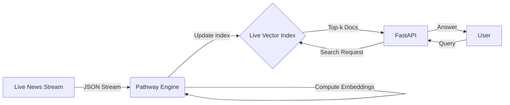

# System Architecture

## Overview
The Live News Dynamic RAG system is designed to provide real-time intelligence by retrieving the most up-to-date information from a streaming data source. Unlike traditional RAG systems that require batch re-indexing, this system uses **Pathway** to handle data ingestion, embedding updates, and index maintenance continuously.

## Components

### 1. Data Source (Streaming)
- **Live Simulator**: A Python script (`app/connectors/live_news.py`) appends JSON records to a file (`data/news_stream.jsonl`).
- **Real-time Updates**: Pathway watches this file system event stream.

### 2. Stream Processing Pipeline (Pathway)
- **Ingestion**: `pw.io.fs.read` reads the stream in `streaming` mode.
- **Vectorization**: A User-Defined Function (UDF) uses `sentence-transformers` to generate embeddings on the fly.
- **Dynamic Indexing**: An in-memory KNN index is updated incrementally as new vectors arrive.
- **Serving**: The pipeline exposes an HTTP endpoint (`pw.io.http`) to accept queries and return nearest neighbors.

### 3. RAG Engine & API
- **FastAPI**: Acts as the frontend gateway.
- **Logic**: Receives user query -> Sends to Pathway -> Gets context -> Formats answer.
- **No Stale Data**: Since the Pathway index is live, the API always retrieves the latest state.

## Diagram

